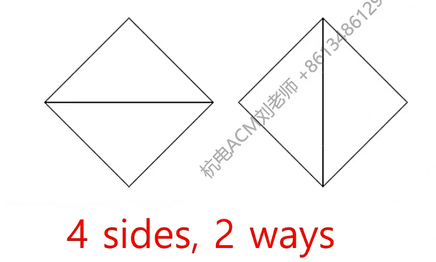
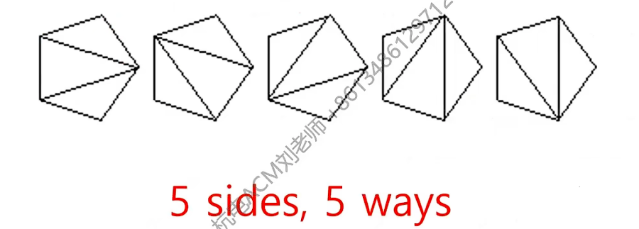
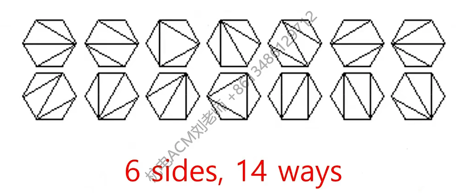
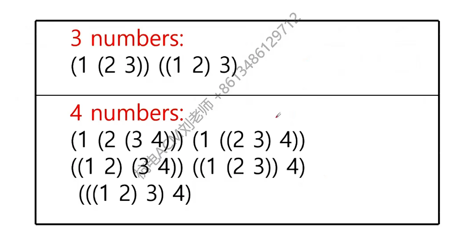
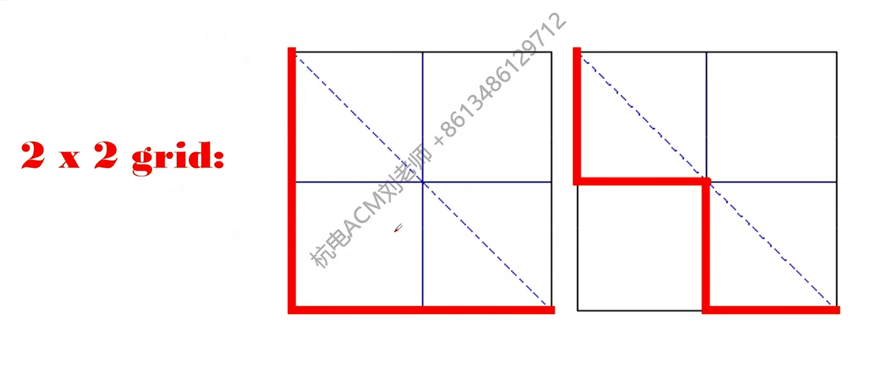
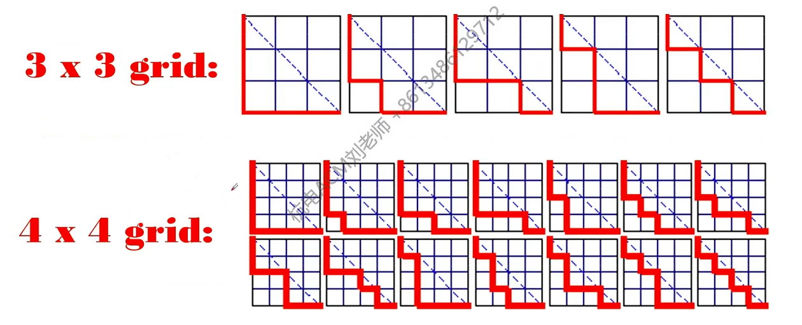
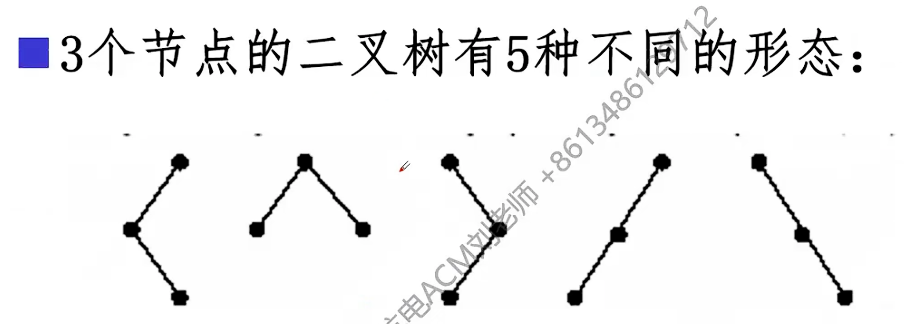

## HDOJ-P2046骨牌铺方格

### 在2×n的一个长方形方格中,用一个1× 2的骨牌铺满方格,输入n ,输出铺放方案的总数.例如n=3时,为2× 3方格，骨牌的铺放方案有三种,如下图：

很简单我们能很清楚的意识到这是一个递归类型的题目，题目的难点也就推导出递归表达式，首先很容易想到`f(n)`可以的组成一部可以看成`f(n - 1)`再添加一个竖着的骨牌砖块(可以认为这个竖着的砖块就是`f(1)`)，紧接着还有一部分的组成肯定是第`n`处不是竖着的骨牌，这一部分肯定是第`n - 1`和`n`横着的骨牌，这一部分可以看成`f(n - 2)`与`f(2)`去除最后一块是竖着的组合，那接下来我们就要考虑`f(n)`是否可以与`f(n - 3)`与`f(3)`的某一种的组合有关，要找出这种组合，首先其不能具有`f(1)`和`f(2)`参与组合的部分：*即其最后一块不能是竖着的，倒数第一块和倒数第二块不能是两个横着的*，通过例子我们发现`f(3)`参与组合的种类为`0`即由`f(1)`和`f(2)`参与组合的种类能包含`f(3)`，那么他们也必然包含其余的项，再由于参与构成`f(n)`的`f(1)`和`f(2)`中的种类均为`1`那么很容易由递推式`f(n) = f(n - 1) + f(n - 2) (n >= 3)`

## HDOJ-P2047阿牛的EOF牛肉串

### 今年的ACM暑期集训队一共有18人，分为6支队伍。其中有一个叫做EOF的队伍，由04级的阿牛、XC以及05级的COY组成。在共同的集训生活中，大家建立了深厚的友谊，阿牛准备做点什么来纪念这段激情燃烧的岁月，想了一想，阿牛从家里拿来了一块上等的牛肉干，准备在上面刻下一个长度为n的只由"E" "O" "F"三种字符组成的字符串（可以只有其中一种或两种字符，但绝对不能有其他字符）,阿牛同时禁止在串中出现O相邻的情况，他认为，"OO"看起来就像发怒的眼睛，效果不好。你，NEW ACMer,EOF的崇拜者，能帮阿牛算一下一共有多少种满足要求的不同的字符串吗？

这同样是一个递归的问题，但是在我看来要弄明白其递推表达式的话要用两个数组，因为在处理这个问题时第*n - 1*位的是否为*o*是会影响最后一位的情况，所以我准备了三个数组*total*有*n*位所有的满足要求的字符串,*has_o*有*n*位且其为*o*的所有的满足要求的字符串,*no_o*有*n*位且其不为*o*的所有的满足要求的字符串,很明显`total[n] = has_o[n] + no_o[n]`，首先让我们分析*has_o*因为其最简单，`has_o[n] = no_o[n - 1]`第*n*位是*o*的数量和第*n - 1*不是*o*的数量一样，这很容易想到.*no_o[n]*由于其最后一位不是*o*对前一位的数值无要求故其是*total[n - 1]*的2倍即`no_o[n] = 2 * total[n - 1]`。同样的我们对*total*分析，首先利用*total[n] = has_o[n] + no_o[n]*我们代换可得*total[n] = no_o[n - 1] + 2 * total[n - 1]*其中的*no_o[n - 1] = 2 * total[n - 2]*,故得到一个递推式`total[n] = 2 * (total[n - 1] + total[n - 2]) (n >= 3)`这种递推式我们仅仅借助*no_o*和*has_o*而我们在实际的代码中不需要创建的。第二种也是我所采用的做法即 *total[n]* 一定是由 *total[n - 1]* 构成当 *total[n - 1]* 是*o*那么此时第*n*位有两种选择即 *2 * has_o[n - 1] = 2 * no_o[n - 2]* 当 *total[n - 1]* 不是*o*那么此时第*n*位有三种选择即 *3 * no_o[n - 1]* 那么`total[n] = 3 * no_o[n - 1] + 2 * no_o[n - 2] (n >= 3)`在这种思想下就需要实例化*total, no_o, has_o*了并需要在循环中对三者按照推理的公式进行更新。同样的,这两者的递推公式可以相互推导出对方.

## HDOJ-P2048神、上帝以及老天爷 && HDOJ-P2049考新郎

*这两者的题目全部都涉及了同一个数学模型：全排错模型*

### 某人写了n封信，这n封信对应的有n个信封，问把所有的信都装错信封的情况共有多少种？

设错排数位`D[n]`:
- 步骤1：考虑第n封信，把它装入其他信封中的第k个信封中，有n-1种方法
- 步骤2：考虑第k封信，这时有2种情况：
  - 情况1：第k封信装入第n个信封中，那么接着对(除第n封和第k封信外)剩余的n-2封信进行全错排即完成了该事，有 *D(n-2)* 种方法；
  - 情况2：第k封信不装入第n个信封中，那么接着对(除第n封信外)剩余的n-1封信进行全错排即完成了该事，有 *D(n - 1)* 种方法；
- 故：`D[n] = (n - 1) * (D[n - 1] + D[n - 2]) (n >= 3)`

## HDOJ-P2050折线分割平面

### 我们看到过很多直线分割平面的题目，今天的这个题目稍微有些变化，我们要求的是n条折线分割平面的最大数目。比如，一条折线可以将平面分成两部分，两条折线最多可以将平面分成7部分，具体如下所示。

#### 折线分割模型
- 第*n*条折线的两条射线最多可以与前面的 *2(n-1)* 条射线相交，产生 *2×2(n-1)=4(n-1)* 个交点
- 但这些交点分布在两条射线上，每条射线被分成 *2(n-1)+1* 段
- 两条射线共被分成 *2[2(n-1)+1] = 4n-2* 段
- 然而，转折点处这两段是连接的，需要减去 *1* 个重复计数
- 所以新折线被分成 *(4n-2)-1 = 4n-3* 段
- 每一段都会穿过一个已有区域并将其一分为二，因此新增 *4n-3* 个区域
- `f[n] = f[n - 1] + 4 * n - 3 (n >= 2)`
  
#### 直线分割模型
- 第*n*条直线最多可以与前面的 *n-1* 条直线相交，产生 *n-1* 个交点
- 故这条直线共被分成 *(n - 1) + 1 = n* 段
- 每一段都会穿过一个已有区域并将其一分为二，因此新增 *n* 个区域
- `f[n] = f[n - 1] + n (n >= 2)`

## 递推问题例题

### PHT学校有很多学生。有一天，校长希望所有学生站成一排，并且规定女孩不能单独站。换句话说，要么队列中没有女孩，要么不止一个女孩并排站。比如，n=4时候，有以下7种可能的合法队列（F女生，M男）：FFFF、FFFM、MFFF、FFMM、MFFM、MMFF、MMMM。 给定人数n，求所有可能的n个人的合法队列数。

我在这里提供两种递推关系，两种递推关系可以推出来彼此。

#### 第一种
- 首先，第 *n* 个同学只有男女两种情况，若最后一个同学是男生，那么最后一个为男生的情况有 *F(n - 1)* 种，若最后一位为女生，去我们就要考虑更多情况了，我是这样思考的，假设 *n* 为女且只有零个女生与其相邻，那么就说明 *n - 1* 为男，这不符合我们的要求不考虑，那若是有且只有一个女生与第 *n* 位女生相邻即 *n - 1* 为女生， *n - 2* 为男生，那么这个情况的值不就是 *F(n - 3)* 嘛(*n、n - 1、n - 2*的性别都确定了)。那若是有且仅有两个女生与与第 *n* 位女生相邻即 *n - 1* 为女生， *n - 2* 为女生， *n - 3*为男生，这个值不就是 *F(n - 4)* 嘛......直到我们推到有且仅有 *n - 3* 位女生与第 *n* 位女生相邻，即从第 *3* 位 到第 *n - 1* 位都是女生，第 *2* 位为男生，这个值不就是 *F(1)* 嘛.再到有且仅有 *n - 2* 位女生与第 *n* 位女生相邻，即从第 *2* 位 到第 *n - 1* 位都是女生，第 *1* 位为男生，这有且仅有这一种情况，直到全是女生，这也有且仅有一种情况。*我们有考虑重复的情况或者漏掉的情况吗？不，没有，由于我们从最后连续出现的女孩数量考虑而且女生最后连续出现的数量有唯一性且我们把这种唯一性全列举了，所以并不会出现遗漏或者重复* 所以我们有数学公式 `F(n) = F(n - 1) + F(n - 3) + F(n - 4) + ...... + F(1) + 2 (n >= 4) ----1`, *那么这样就可以做题了吗？我们可以考虑一下简化，由于直接这样做算出第n位的时间复杂度为O(n)，而且我们发现在计算F(n)时的值F(n - 1)也用到了所以：*`F(n - 1) = F(n - 2) + F(n - 4) + F(n - 5) + ...... + F(1) + 2 (n >= 5) ----2`我们从 *2* 式子可以得到`F(n - 1) - F(n - 2) = F(n - 4) + F(n - 5) + ...... + F(1) + 2`其中等式右方是 *1* 式子右方的一部分，所以得到：`F(n) = F(n - 1) + F(n - 3) + F(n - 1) - F(n - 2)` 即 `F(n) = 2 * F(n - 1) + F(n - 3) - F(n - 2) (n >= 4)`这个式子才是我们最终的递推式，通过它我们计算某一项的时间复杂度为 *O(1)*。
  
#### 第二种
- 首先老样子分析最后一位是男是女，若最后一位是男生其数量是*F(n - 1)* 种若最后一位是女生那么第 *n - 1* 位肯定是女生那么这时候这个值就是 *F(n - 2)*(后两位都是女生)这就是全部了吗？很显然不是，我们现在还需要考虑就是说在后两位不上两位女生能否把一些不合法的情况变得合法，在最后添加两个女生只能对第 *n - 2*位产生影响，若第 *n - 2* 位是女生且第 *n - 3* 位为男生，我们可以通过在期后追加两个女生的情况让其变得合法化那这个值是多少呢？是 *F(n - 4)* 因为我们 *n - 3、n - 2、n - 1、n*的性别已定。所以我们有递推式`F(n) = F(n - 1) + F(n - 2) + F(n - 4) (n >= 5)`两个递推式能互相推出对方。


## 卡特兰数

### 题目引入：2*n 个数字按照顺时针方向围成一个圆，n 条线段把所有的数两两相连，要求线段不能有交叉。求：一共有多少种不同的连线方案？
```
          8          
    7           1      
6                   2  
    5           3      
          4          
```     
这里我们就简单分析一下这F(4)的计算，首先呢，我们随机选一个点，由于其对称性无论我们选取哪一个点都可以等效为选第一个点。这个1点能和2点链接吗？能啊，这样我们就可以把剩下的6个点看作一个F(3)。这个1点能和3点链接吗？不行，因为若想链接2就必须有交点......通过这样一通分析有：*F(4) = F(0)xF(3) + F(1)xF(2) + F(2)xF(1) + F(3)xF(0) (我们定义F(0) = 1)*我们可以有这样的推测 :
$$
f(n) = \sum_{k=0}^{n-1} f(k) \cdot f(n - 1 - k)
$$
为什么和是*n - 1*呢？因为我们在n中选出1对做`分割`的位了。

这个问题所对应的数列也就是*卡特兰数*。*卡特兰数的前面若干项分别是：1，2，5，14，42，132，429，1430，4862，16796，58786，208012，742900，2674440，9694845，......*可以适当记一下其前五位，在许多题目中都会出现卡特兰数，出现卡特兰数的题目都有一定的共性，这点我无法保证自己所说的正确性，不过我会尽可能的把我理解的说出来。

在我们计算我们的连线问题时我们将整个问题按照某种`分割`，分割为了两个互不影响的子问题，且这两个子问题的乘积才是当前分割的答案。那么我们是否可以这样认为当某一个问题可以被`分割`为两个子问题且两个子问题之间不存在交集并且两个子问题的乘积才是本次分割的答案就可以认为这是一种类卡特兰数问题？(这些都是我推测的)不过让我们看几个实际的卡特兰数问题吧：

1.多边形的三角剖分数目

三角形分割成三角形有几种分割方法？1个。

四边形分割成三角形有几种分割方法？2个。

五边形分割成三角形有几种分割方法？5个。

六边形分割成三角形有几种分割方法？14个。

我们可以用相同的方式来解释这一个题目为什么会出现卡特兰数，我们同样可以随便画一条线将原来的n边形来分割成两个小的形状，这两个小的形状的分割数相乘就是我们的这种分割的答案，和我们例题一模一样。

与之类似的还有数组分割：

2.Dyck路径，即对角线下方路径

1x1有几种路径？1种。

2x2有几种路径？2种。

3x3有几种路径？5种。

4x4有几种路径？14种。

为什么呢？考虑路径第一次返回对角线的点（除起点外）。设该点为 (k,k)，其中 1≤k≤n。第一段：从起点(0,0)到(k,k)，要求除起点和终点外，路径不接触对角线（即始终严格在对角线下方）。那么我们的第一步肯定是向下，最后一步肯定是向右。这样的路径等价于从 (0,0) 到 (k−1,k−1) 的标准 Dyck 路径，其数目为F(n - 1)。第二段：从(k,k) 到终点(n,n)，这是一条从(0,0) 到(n−k,n−k) 的标准 Dyck 路径，其数目为F(n - k)。二者相乘即是这次分割的答案，这和我们的例题也是一模一样的。

其对应到实在的题目就是类似：候选人 A、B 两人参加选举，n 个人参加投票，如果在整个唱票过程中，A 从未落后过 B，则不同的唱票方式也满足卡特兰数（假设 A 和 B 的票数最终相等）。

我们可以认为投给A就是向下走一步，投给B就是向右走一步，那这个问题就是一个Dyck路径问题。

3.二叉树的形态

1个节点的二叉树有几种？1种。

2个节点的二叉树有几种？2种。

3个节点的二叉树有几种？5种。

这个不再过多赘述了。

值得一提的是卡特兰数有一个通项公式：
$$
f(n) = \frac{1}{n+1} \binom{2n}{n}
$$
也是很容易看到其通向含有一个阶乘数的计算很容易爆int，所以做卡特兰数的题目一般需要高精度计算。